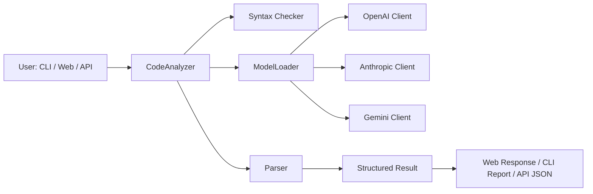
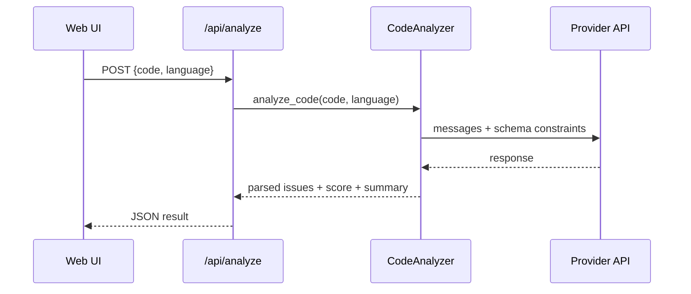

# Code Evaluator

Multi-language code analysis platform for CLI, Web UI, and API workflows.

`Code Evaluator` analyzes source code for syntax problems, bugs, memory/resource risks, security issues, performance bottlenecks, and maintainability concerns. It supports multiple LLM providers through a unified architecture and returns structured, integration-friendly output.

> Current repository state is API-provider based (OpenAI, Anthropic, Gemini). Legacy self-hosted scripts still exist for backward compatibility.

## Introduction

This project is designed for developers, reviewers, and teams that want fast static+LLM-assisted insights without setting up heavyweight local model infrastructure.

You can use it in three ways:
- `CLI`: analyze one or many files and export reports
- `Web`: interactive editor dashboard and analysis history
- `API`: JSON endpoint for editor plugins, CI, or external tools

## Key Features

- Multi-language analysis (C/C++, Python, JavaScript, Java, and more via extension detection)
- Multi-provider LLM backend (`openai`, `anthropic`, `gemini`) via `APIConfig`
- Structured JSON output with summary, score, normalized issues, and suggested fixes
- Web dashboard (`/`) with editor flow plus history page (`/history`)
- API endpoint `POST /api/analyze` for machine-to-machine integration
- Agent mode (CLI + web endpoints under `/api/agent/*`) for multi-step workflows
- Caching for repeated file analysis and markdown/JSON report export support

## Use Cases

### 1) Local Developer Quality Gate

Run analysis before commit to catch high-risk issues early.

```powershell
python -m code_evaluator.main analyze .\examples\example.cpp -v
```

### 2) Team Review Assistant

Use the Web UI to paste snippets during code review and discuss recommendations.

```powershell
python run_web.py
```

Then open `http://localhost:5000`.

### 3) CI or Internal Tooling Integration

Send source text directly to the JSON endpoint and parse issue lists in pipelines.

```powershell
curl -X POST http://localhost:5000/api/analyze `
  -H "Content-Type: application/json" `
  -d '{"code":"def f(x):\n    return 10/x","language":"python"}'
```

### 4) Guided Agent Analysis

Use the agent path for iterative, tool-augmented analysis sessions.

```powershell
python -m code_evaluator.main agent analyze .\examples\example.py --max-steps 15
```

## Demo

### Quick Demo (Web)

```powershell
python -m venv .venv
.\.venv\Scripts\Activate.ps1
pip install -r requirements.txt
Copy-Item .env.example .env
python run_web.py
```

1. Open `http://localhost:5000`
2. Paste code from `examples/example.py`
3. Click **Analyze**
4. Review score, issue categories, and suggested fixes

### Quick Demo (CLI + Export)

```powershell
python -m code_evaluator.main analyze .\examples\example.js --output .\results --report .\reports -v
```

Expected artifacts:
- JSON analysis in `results/`
- Markdown report in `reports/`

## Overall Architecture





## Installation

### Prerequisites

- Python 3.8+
- `pip`
- At least one provider API key

### Install (PowerShell)

```powershell
git clone https://github.com/VanAnh-13/code_evaluator.git
cd code_evaluator
python -m venv .venv
.\.venv\Scripts\Activate.ps1
pip install -r requirements.txt
```

### Optional: Docker

```powershell
docker build -t code-evaluator .
docker run -p 5000:5000 -e API_PROVIDER=openai -e API_KEY=your_key code-evaluator
```

## Running the Project

### Web App

```powershell
python run_web.py
```

### CLI Analyze

```powershell
python -m code_evaluator.main analyze .\examples\example.cpp
python -m code_evaluator.main analyze .\examples\example.py --report .\reports
```

### CLI Agent Modes

```powershell
python -m code_evaluator.main agent chat
python -m code_evaluator.main agent analyze .\examples\example.py
python -m code_evaluator.main agent project .\code_evaluator
```

### Web/API Service Entry

```powershell
python -m code_evaluator.main serve --host 0.0.0.0 --port 5000
```

## Env Configuration

Create local env file:

```powershell
Copy-Item .env.example .env
```

Example values:

```dotenv
API_PROVIDER=openai
API_KEY=sk-your-api-key
API_MODEL=
API_TEMPERATURE=0.1
API_MAX_TOKENS=4096
API_TIMEOUT=120
# API_BASE_URL=
# SECRET_KEY=change-me
```

Environment variables used by current code paths (`code_evaluator/model/config.py`, `code_evaluator/web/app.py`):

| Variable | Purpose | Default |
|---|---|---|
| `API_PROVIDER` | LLM provider: `openai`, `anthropic`, `gemini` | `openai` |
| `API_KEY` | Provider API key | empty |
| `API_MODEL` | Optional model override | provider-specific |
| `API_TEMPERATURE` | Generation temperature | `0.3` |
| `API_MAX_TOKENS` | Max output tokens | `4096` |
| `API_BASE_URL` | Custom endpoint/proxy | unset |
| `API_TIMEOUT` | Request timeout (seconds) | `120` |
| `SECRET_KEY` | Flask secret key | auto-generated |
| `PORT` | Web server port | `5000` |

## Folder Structure

```text
code_evaluator/
|- code_evaluator/
|  |- agent/          # ReAct executor, tools, sessions
|  |- analyzer/       # Code analysis orchestration and parsing
|  |- model/          # Provider configs/clients/factory/loader
|  |- report/         # JSON + Markdown exporters/generators
|  |- utils/          # cache, file utils, security helpers
|  |- web/            # Flask app factory, routes, templates, static assets
|  '- main.py         # CLI entry point
|- prompts/           # system prompts and output schema
|- examples/          # sample source files for quick tests
|- run_web.py         # web startup wrapper
|- requirements.txt
'- README.md
```

## Contribution Guidelines

We welcome contributions of all sizes.

1. Fork and create a feature branch from `main`
2. Keep changes scoped and include tests when behavior changes
3. Run relevant checks locally before opening a PR
4. Add/adjust documentation for user-facing updates
5. Open a PR with clear context, expected behavior, and sample output

Suggested local sanity commands:

```powershell
python -m pytest -q
python -m code_evaluator.main analyze .\examples\example.cpp
```

## License

This project is distributed under the MIT License.

## Roadmap

Planned direction (proposal aligned with current modules):

- [ ] **Q2 2026**: add first-class CI pipeline docs and reproducible quality gates
- [ ] **Q2 2026**: improve agent streaming UX and step visualization in web UI
- [ ] **Q3 2026**: add configurable rule profiles (security-first, performance-first, style-first)
- [ ] **Q3 2026**: introduce baseline diff mode (compare current analysis vs previous run)
- [ ] **Q4 2026**: expand provider observability (latency, retries, provider fallback telemetry)
- [ ] **Q4 2026**: package release hardening (versioned changelog + release automation)

## Legacy Notes

- Legacy scripts such as `code_analyzer.py` and `finetune.py` remain in the repository for earlier workflows.
- The active architecture in this README follows the package-based API-provider implementation under `code_evaluator/`.
