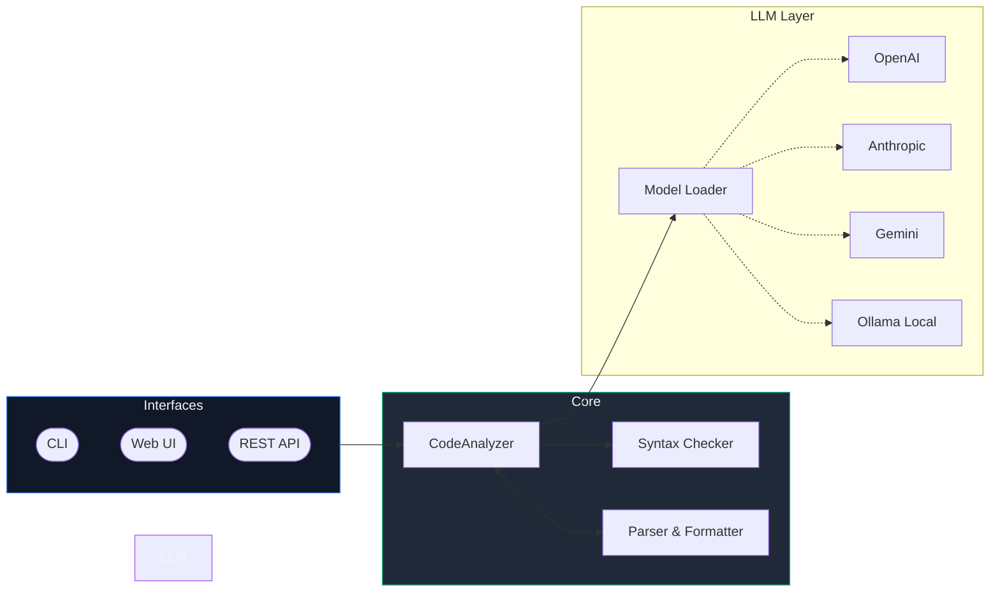
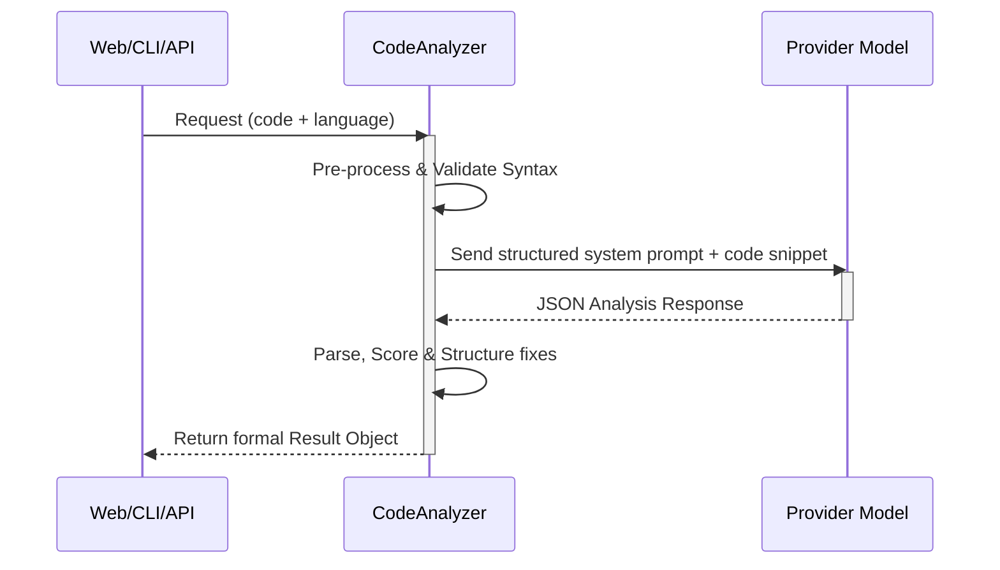

<div align="center">
  
  <h1><b>Code Evaluator</b></h1>
  <p>Multi-language code analysis platform for CLI, Web UI, and API workflows.</p>

  <p>
    <a href="#introduction">Introduction</a> •
    <a href="#key-features">Key Features</a> •
    <a href="#overall-architecture">Architecture</a> •
    <a href="#installation">Installation</a> •
    <a href="#running-the-project">Get Started</a> •
    <a href="#env-configuration">Configuration</a> •
    <a href="#roadmap">Roadmap</a>
  </p>

  <p>
    
    
    
  </p>
</div>

<br />

Code Evaluator meticulously analyzes your source code for syntax problems, logic bugs, memory/resource risks, security issues, performance bottlenecks, and maintainability concerns. Built on a unified architecture, it seamlessly supports multiple popular LLM providers—empowering you to receive deep, structured insights and auto-remediation recommendations effortlessly.

---

## 🚀 Introduction

This project is built for developers, reviewers, and engineering teams seeking **lightning-fast static insights complemented by LLM-assisted deep understanding**. Unlike heavyweight local environments, Code Evaluator provides a lightweight, modular quality gate that you can embed anywhere.

You can interface with the platform in three flexible modes:
- **CLI**: Analyze individual scripts or bulk-evaluate entire repositories, exporting precise multi-format reports.
- **Web UI**: Navigate an interactive dashboard packed with real-time feedback and analysis history.
- **REST API**: Harness JSON standard endpoints to build editor plugins, CI/CD integrations, or complex external workflows.

> **✨ New in v1.0**
> 🦙 Run entirely local, privacy-first evaluations with **Ollama** support.
> 🧪 Complete unit testing infrastructure powered by **Pytest**.
> 🚀 Automated test iterations and fast track verifications via **GitHub Actions**.

---

## ✨ Key Features

- **🌐 Comprehensive Language Support:** Analyzes over 10 languages including C/C++, Python, JavaScript, Java, TypeScript, Go, and Rust.
- **🤖 Unified LLM Backend:** Seamless interop with OpenAI, Anthropic, Gemini, and local **Ollama** models.
- **📊 Standardized JSON Output:** Delivers unified summaries, actionable metrics, category-level insights, and line-by-line suggested fixes.
- **💻 Modern Web Dashboard:** A sleek, glassmorphic UI providing code editor integration and history tracking.
- **🔌 Enterprise REST API:** Out-of-the-box `POST /api/analyze` capabilities for direct toolchain integration.
- **🧠 Advanced Agentic Workflows:** Supports conversational agent sessions for multi-step AI code analysis.
- **⚡ Built for Speed:** Smart prompt caching, parallel analysis operations, and efficient memory usage.
- **📝 Exportable Reports:** Instantly generate clean Markdown summaries and structured JSON.

---

## 🏛 Overall Architecture

Code Evaluator uses a pluggable client-service methodology separating UI, Core logic, and the Provider Network. 



### Analysis Pipeline



---

## 📦 Installation

### Prerequisites
- **Python 3.8+**
- Git bash or Windows PowerShell
- Required API keys (unless solely relying on local Ollama integration)

### Local Environment Setup

```powershell
# 1. Clone the repository
git clone https://github.com/VanAnh-13/code_evaluator.git
cd code_evaluator

# 2. Initialize and activate a virtual environment
python -m venv .venv
.\.venv\Scripts\Activate.ps1   # Windows
# source .venv/bin/activate    # Linux/Mac

# 3. Install packages
pip install -r requirements.txt
```

### 🐳 Optional: Docker Compose

For completely isolated execution without environment interference:

```bash
docker build -t code-evaluator .
docker run -p 5000:5000 -e API_PROVIDER=openai -e API_KEY=your_key code-evaluator
```

---

## 🛠 Running the project

### 1. Web Dashboard (Interactive Mode)
The easiest way to review code drops dynamically.
```powershell
python run_web.py
```
> Open [http://localhost:5000](http://localhost:5000) to view the Web UI.

### 2. CLI: Instant File Analysis
Analyze complex directories or solitary critical files right from your build script.
```powershell
# Quick evaluation
python -m code_evaluator.main analyze .\examples\example.cpp

# Output verbose reports into separate directories
python -m code_evaluator.main analyze .\examples\example.py --report .\reports -v
```

### 3. Agent & Chat Modes
Launch an interactive loop for deep codebase comprehension.
```powershell
python -m code_evaluator.main agent chat
python -m code_evaluator.main agent project .\code_evaluator
```

### 4. Headless REST API
Expose the analyzer as an internal backend service.
```powershell
python -m code_evaluator.main serve --host 0.0.0.0 --port 5000
```

---

## ⚙️ Env Configuration

Code Evaluator uses secure environment variables to manage provider configurations.

Create your `.env` configuration file:
```powershell
Copy-Item .env.example .env
```

Open `.env` and fill in necessary keys. Here's a sample map to get you started:

| Variable | Purpose | Default |
|---|---|---|
| `API_PROVIDER` | Defines the LLM provider (`openai`, `anthropic`, `gemini`, `ollama`) | `openai` |
| `API_KEY` | Provider secret key (omit if using `ollama`) | `""` |
| `API_MODEL` | Explicitly override target engine representation | *provider-specific* |
| `API_TEMPERATURE` | Float configuration for determinism | `0.3` |
| `API_MAX_TOKENS` | Maximum limit on response string limits | `4096` |
| `API_BASE_URL` | Override the proxy/base root (e.g. `http://localhost:11434` for Ollama) | `unset` |
| `API_TIMEOUT` | Default request limits to prevent hanging | `120` |
| `PORT` | Flask internal routing port | `5000` |

---

## 📂 Folder Structure

Maintaining structure limits abstraction fatigue. Find your way quickly through standard architecture mappings:

```text
code_evaluator/
├── code_evaluator/
│   ├── agent/          # Multi-step conversational ReAct executors
│   ├── analyzer/       # Core static parser operations and AST mappings
│   ├── model/          # Interop classes (OpenAI, Anthropic, Gemini, Ollama)
│   ├── report/         # File generators (Markdown compilation, JSON extraction)
│   ├── utils/          # Standard operations (cache handlers, security formatting)
│   └── web/            # Flask Web App, REST Routes, Static CSS/JS, Jinja HTML
├── docs/               # Advanced documentation references
├── examples/           # Mock scripts to test evaluators quickly
├── tests/              # Pytest assertions & workflow coverage logic
└── run_web.py          # Primary entry wrapper for the web UI
```

---

## 🤝 Contribution Guidelines

We love seeing the open-source community expand our analyzers. If you wish to contribute, please follow our flow:

1. **Fork** the repository and create your feature logic branch: `git checkout -b feature/amazing-feature`.
2. **Develop** your code. Ensure formatting remains intact.
3. **Validate** via our test-suite locally:
   ```powershell
   pytest --cov=code_evaluator
   flake8 code_evaluator tests
   ```
4. **Commit** with semantic messages (`feat: improve C++ memory parsing`).
5. **Push** to the branch and open a **Pull Request**.

For more specifics on design practices, check [CONTRIBUTING.md](CONTRIBUTING.md).

---

## 🗺 Roadmap

Our goal is continuous innovation.

- ⏳ **Q2 2026:** Out-of-the-box CI/CD GitHub Action package published to the Marketplace.
- ⏳ **Q2 2026:** Agent streaming enhancements on the frontend for real-time visualization.
- ⏳ **Q3 2026:** Custom Rule Profiles: Opt into strict-modes (e.g., Security Only vs Speed Focus).
- ⏳ **Q3 2026:** Historical Diffing feature allowing trend visualization across pipeline iterations.
- ⏳ **Q4 2026:** Expanded provider telemetry (Latency graphs, Retry statistics).

---

## 📄 License

Code Evaluator is proudly an open source endeavor. Distributed under the **MIT License**. See `LICENSE` for more information.

<div align="center">
  <sub>Built with ❤️ for better, safer code.</sub>
</div>
